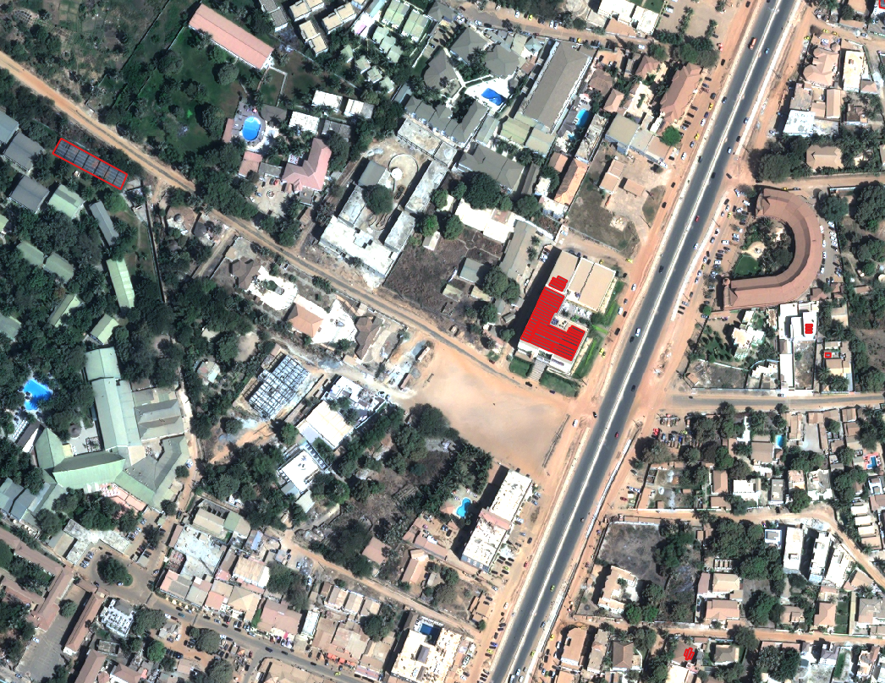

# Gambia PV
Training a neural network model on human labelled photovoltaic panels (pv) across the greater Banjul, The Gambia area.

## Introduction

A very simple workflow for preparing a dataset and training a standard unet is provided. 

The dataset is generated by grouping all human labelled polygons within 4 meters from each other and drawing images chips around the centroids of each grouping by windowing into the provided high resolution (30cm) imagery. This is to prevent drawing redundant image chips around photovoltatic panels where there are multiple units on a roof top or area and isolate the test samples such that those in that split are completely unseen locations.

Additionally chips are generated around background polygons of confirmed locations with no photovoltaic cells. These background polygons correspond to locations where previous model iterations produced false positives. The background and pv image chips/masks are distinguished by either _pv or _bg suffix in the train and test sample directories (see below). ~100 512px pv chips and ~253 512px background chips are generated. Note: while there is little to no errors in the human labeleld polygons, there is potentially unlabelled pv panels in and around both pv and background polygons. This is however difficult to prevent due to the vast area cover and size of some panels. We consider this part of the problem to solve.

Also provided is a geojson with major and minor roads across the greater Bajul area taken from open street map. From previous model iterations, we find road networks depending on locations are easily confused with pv panels due to spectrally similar properties and dust obscuring some panels. This is especially useful for filtering the final product but is by no means a comprehensive filter.

Due to the small size of the training data, simple logic is provided to augment the images as they are passed through the network. This is done after post data generation to save disk space and prevent data leakage with the train test split. Likewise, since all image chips are drawn around the centroid of groupings, the center center pixels of the pixel chips will likely belong to pv class. This should be taken into consideration when interpreting results.

## Basic Usage

### install depedencies
```console
git clone https://www.github.com/sig-gis/gambia_pv
# cd into directory
conda install torch torchvision
conda install -c conda-forge rasterio

# optional for logging. cometml provides 500GB of storage for research organizations
# this can be replaced in gambia_pv/hpc/02_train_model.slurm
conda install -c anaconda -c conda-forge -c comet_ml comet_ml
```
### set environment variables
```console
export BASE_PATH="path_to_repo_root_directory"
export EXPERIMENT_NAME="name_of_model_iteration_experiment"
```
### download imagery
Data is storage in public cloud buckets. The high resolution imagery is stored as a single tif and is ~129.3GB. 6 Bands are provided by the Pleides NEO team: RGB, Blue, NIR, and Deep Blue. See links below.

```console
# download raw data
gcloud storage cp -r gs://pv_mapping/pleides_RGBNED.tif  ./data
gcloud storage cp -r gs://pv_mapping/background.geojson ./data
gcloud storage cp -r gs://pv_mapping/pv_polygons.geojson ./data
gcloud storage cp -r gs://pv_mapping/roads.geojson ./data

# alternatively download precomputed data (~2GB)
gcloud storage cp -r gs://pv_mapping/precomputed ./data
```

### run workflow
```console
# the output of the training and test samples is < 2GB total
python 00_generate_chips.py && python 01_calculate_stats.py

# with batch_size=16, the provided network uses ~8GB of VRAM
python 01_train_model.py && python 02_test_model.py

# the default is to run inference across the entire city area with 10% overlapping 224px windows, taking the mean output, and save as a single tif (total: 264320 image chips). This requires a fair amount of CPU RAM and could be adjusted to generate multiple tifs.
python 04_inference.py
```

## Data

### Background polygon extent
We highlight locations that are spectrally similar to PV Panels (ie roads, gray roofs, shadows, buildings).


### PV Panel polygon extent
Distribution of pv polygons. Note: the close proximity of background polygons and pv panels. This is taken into account when drawing image chips.


### Example PV Polygons
Example polygons for a smaller area. Notice varying sizes, obscurity, and grouping size. These are among the clearer examples.


## Data Directory Structure
data/\
├── test_model/         # mask outputs for test_samples given a trained network \
│   └── ... \
├── test_samples/       # test samples of pv image chips and background image chips \
│   └── images \
│   └── masks \
├── train_samples/      # train samples of pv image chips and background image chips \
│   └── images \
│   └── masks \
├── checkpoints/        # directory where checkpoints are saved from the unet \
├── pv_polygons.geojson # geojson contain human labelled polygons of photovoltaic cells \
├── roads.geojson       # geojson containing size adjusted polygons of roads \
├── background.geojson  # geojson containing confirmed no pv panel areas \
├── all_band_stats.yaml # yaml containing calculated band stats from train samples \
├── pleides_RGBNED.tif  # yaml containing calculated band stats from train samples \
└──...\
